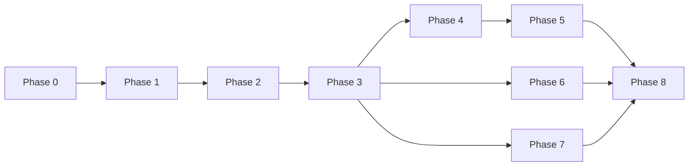

# Lightweight Deployment Platform — Implementation Plan

ระบบจัดการ deployment แบบเบา สำหรับใช้งานบนเซิร์ฟเวอร์เดียว โดยเน้นความสามารถหลัก:

- เชื่อมต่อ GitHub App และเลือก repository/branch
- Auto deploy เมื่อมีการ push
- จัดการ Deploy Settings และ Environment Settings
- จัดการ Domains พร้อม HTTPS อัตโนมัติ
- ดู Build Logs และ Runtime Logs
- จัดการ Docker named volumes
- Restart, Redeploy และ Rollback

## ขอบเขตของรุ่นแรก

รุ่นแรกเป็น **single-node, single-admin** และใช้ Docker Engine บน Linux เครื่องเดียว ไม่รวม Kubernetes, Docker Swarm, multi-node scheduling, team/role, database marketplace, object storage, billing หรือ autoscaling

## Technology Baseline

| ส่วน | ตัวเลือกแนะนำ | หมายเหตุ |
|---|---|---|
| Dashboard | Nuxt | UI, authentication และ server routes ที่ไม่ทำงานหนัก |
| Control API | Elysia บน Bun | API แบบ type-safe, webhook, queue control และ SSE log streaming |
| Deploy Worker | Bun service แยก process | ใช้ codebase/type definitions ร่วมกับ API แต่แยกสิทธิ์ Docker |
| Database | SQLite (WAL mode) | เหมาะกับ single-node และสำรองง่าย |
| Reverse proxy | Traefik | Docker labels, domain routing และ ACME HTTPS |
| Runtime | Docker Engine | build/run/inspect/logs/volumes |
| Live logs | Server-Sent Events | เรียบง่ายกว่า WebSocketสำหรับ one-way stream |
| Source provider | GitHub App | private repository และ webhook โดยไม่ใช้ PAT ระยะยาว |

Backend ทั้งระบบใช้ TypeScript โดยมี Elysia เป็น HTTP framework และ Bun เป็น runtime ส่วนงาน deploy ที่ใช้เวลานานต้องทำใน worker แยก process ไม่ทำค้างอยู่ใน HTTP request

## Phase Map

| Phase | เป้าหมาย | เอกสาร | สถานะ |
|---|---|---|---|
| 0 | ตรึง scope, architecture และข้อกำหนดระบบ | [phase-00-foundation.md](./phase-00-foundation.md) | ✅ ผ่าน Exit Criteria |
| 1 | สร้าง control plane, authentication และ persistence | [phase-01-control-plane.md](./phase-01-control-plane.md) | ✅ ผ่าน Exit Criteria |
| 2 | เชื่อม GitHub App และเลือก repository/branch | [phase-02-github-app.md](./phase-02-github-app.md) | ⬜ ยังไม่เริ่ม |
| 3 | สร้าง deploy engine และ deployment queue | [phase-03-deploy-engine.md](./phase-03-deploy-engine.md) | ⬜ ยังไม่เริ่ม |
| 4 | Environment Settings และ secret handling | [phase-04-environment.md](./phase-04-environment.md) | ⬜ ยังไม่เริ่ม |
| 5 | Domains, routing และ HTTPS | [phase-05-domains.md](./phase-05-domains.md) | ⬜ ยังไม่เริ่ม |
| 6 | Build/Runtime Logs และ observability | [phase-06-logs.md](./phase-06-logs.md) | ⬜ ยังไม่เริ่ม |
| 7 | Volumes, backup hooks และ lifecycle safety | [phase-07-volumes.md](./phase-07-volumes.md) | ⬜ ยังไม่เริ่ม |
| 8 | Hardening, recovery และ production release | [phase-08-production.md](./phase-08-production.md) | ⬜ ยังไม่เริ่ม |

ระบบตอนนี้ **ยังไม่สามารถ deploy อะไรได้** — มีเพียง control plane (login, project configuration)
GitHub App, deploy queue, environment secrets, domains flow, logs และ volumes ยังไม่ถูกสร้าง

## เอกสาร Foundation (ผลลัพธ์ Phase 0)

- [requirements.md](./requirements.md) — user stories และ non-goals
- [conventions.md](./conventions.md) — API conventions, naming, supported platforms
- [database-schema.md](./database-schema.md) — schema design และ migration strategy
- [encryption.md](./encryption.md) — encryption envelope และ key rotation
- [threat-model.md](./threat-model.md) — threat model เบื้องต้น
- [adr/](./adr/) — decision records สำหรับเรื่องที่เปลี่ยนภายหลังยาก

## ลำดับความสัมพันธ์

## Definition of Done ระดับผลิตภัณฑ์

รายการนี้เป็นเกณฑ์ของ **MVP ทั้งหมด** — ยังไม่มีข้อใดผ่านครบ เพราะต้องรอ Phase 2–8
(สถานะรายเฟสดูที่ตาราง Phase Map ด้านบน)

- Admin ติดตั้ง GitHub App เลือก private repository และ branch ได้
- Push ไปยัง branch ที่กำหนดสร้าง deployment เพียงหนึ่งงานต่อ webhook delivery
- Build ที่ล้มเหลวไม่กระทบ container รุ่นปัจจุบัน
- Container ใหม่ต้องผ่าน health check ก่อนรับ traffic
- Domain ออกและต่ออายุ HTTPS ได้ พร้อมตรวจ DNS และแสดงสถานะ
- Secret ไม่ปรากฏใน API response, UI, build log หรือ runtime log
- ดู logs แบบ live ได้และระบบจำกัด disk usage
- Named volume ไม่ถูกลบขณะใช้งาน และการลบต้องยืนยันอย่างชัดเจน
- Restart แล้ว queue, project configuration, certificates และ active deployment ยังถูกต้อง
- มี runbook สำหรับ backup/restore และ rollback control plane

## ประมาณการเวลา

| กลุ่มงาน | ระยะเวลาโดยประมาณ |
|---|---:|
| Phase 0–2 | 4–7 วัน |
| Phase 3–5 | 7–12 วัน |
| Phase 6–7 | 3–5 วัน |
| Phase 8 | 3–5 วัน |
| รวม MVP production-ready | 17–29 วันทำงาน |

ประมาณการนี้สำหรับนักพัฒนาหนึ่งคนที่คุ้นเคยกับ Docker, Nuxt และ backend development โดยยังไม่รวมงาน branding หรือ mobile app
