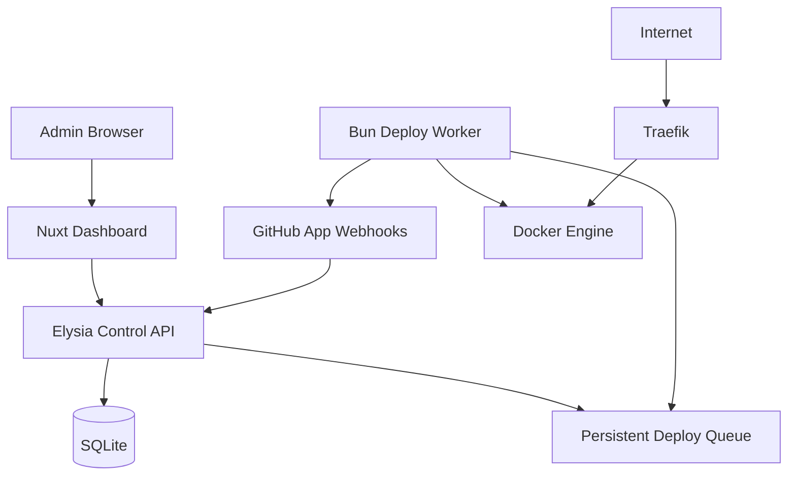

# Phase 0 — Foundation และ Architecture Contract

## เป้าหมาย

ตรึงขอบเขตและสัญญาทางสถาปัตยกรรมก่อนเริ่ม implementation เพื่อป้องกันการขยายเป็นแพลตฟอร์ม orchestration เต็มรูปแบบโดยไม่จำเป็น

## ผลลัพธ์ที่ต้องส่งมอบ

- Product requirements ฉบับ MVP
- Architecture diagram และ trust boundaries
- Domain model และ deployment state machine
- API conventions และ error format
- Repository structure
- Local development environment
- Threat model เบื้องต้น
- Decision records สำหรับเรื่องที่เปลี่ยนภายหลังได้ยาก

## Functional Scope

### รวมใน MVP

- Single admin account
- GitHub App installation และ repository picker
- Dockerfile-based deployment
- Auto/manual deploy
- Runtime environment variables
- หนึ่ง service ต่อหนึ่ง project ในรุ่นแรก
- หลาย domain ต่อ project
- HTTPS อัตโนมัติ
- Build/runtime logs
- Docker named volumes
- Restart, stop, redeploy และ rollbackหนึ่ง revision

### ไม่รวมใน MVP

- Docker Compose หลาย service
- Preview deployments ต่อ pull request
- Multi-server และ scheduling
- Horizontal scaling
- Managed databases
- Teams, RBAC และ audit compliance ขั้นสูง
- Shell terminal ผ่าน browser
- Arbitrary host bind mounts
- Custom Traefik configuration จากผู้ใช้

## Architecture Contract



### Trust boundaries

- Internet-facing: Dashboard login, GitHub callback, webhook endpoint และ ports 80/443
- Privileged: worker ที่เข้าถึง Docker Engine
- Secret-bearing: GitHub private key, webhook secret, encryption master key และ project environment secrets
- Untrusted input: repository source code, Dockerfile, build output, domain และ webhook payload

## Core Domain Model

| Entity | หน้าที่ |
|---|---|
| `users` | บัญชี admin และ session policy |
| `github_installations` | installation ID และ account metadata |
| `projects` | repository, branch, build configuration และ desired state |
| `deployments` | commit SHA, status, timestamps, image และ failure reason |
| `deploy_jobs` | durable queue, attempts และ lease |
| `environment_variables` | encrypted value และ build/runtime scope |
| `domains` | hostname, target port, TLS/DNS status |
| `volumes` | Docker volume name, mount path และ lifecycle state |
| `webhook_deliveries` | delivery ID สำหรับ idempotency |

## Deployment State Machine

```text
queued
  -> cloning
  -> building
  -> starting
  -> health_checking
  -> activating
  -> succeeded

ทุก state ก่อน succeeded -> failed หรือ cancelled
```

กติกา:

- การเปลี่ยน state ต้องเป็น transaction และบันทึก timestamp
- งานเดียวทำได้โดย worker เดียวผ่าน lease
- การ retry ต้องไม่สร้าง active container ซ้ำ
- `failed` ต้องมี machine-readable code และข้อความสำหรับผู้ใช้

## Repository Structure ที่แนะนำ

```text
apps/
  dashboard/
  control-api/
internal/
  docker/
  github/
  deploy/
  proxy/
migrations/
deploy/
  control-plane/
docs/
```

## งานดำเนินการ

- [ ] เขียน user stories และ non-goals
- [ ] ตั้งค่า Bun workspace และ TypeScript shared packages
- [ ] สร้าง Elysia Control API พร้อม typed request/response schemas
- [ ] สร้าง Bun Deploy Worker เป็น entrypoint และ process แยกจาก API
- [ ] กำหนด supported Linux distribution และ Docker version
- [ ] กำหนด naming convention ของ image, container, network และ volume
- [ ] กำหนด API prefix เช่น `/api/v1`
- [ ] กำหนด error envelope และ request ID
- [ ] ออกแบบ database schema และ migration strategy
- [ ] กำหนด encryption/key rotation approach
- [ ] ทำ threat model สำหรับ Docker socket, webhook, build และ secrets
- [ ] ทำ local stack ที่เปิด Dashboard, API, SQLite และ Traefik ได้
- [ ] เพิ่ม lint, typecheck, unit test และ migration check ใน CI

## การทดสอบ

- เปิด local stack จากเครื่องใหม่ได้ตาม README
- Migration จากฐานข้อมูลว่างทำงานและ rollback ใน development ได้
- API health endpoint ตรวจ DB และ worker readiness แยกกัน
- State machine ปฏิเสธ transition ที่ไม่ถูกต้อง

## Exit Criteria

- ไม่มีคำถามค้างเรื่อง scope ที่กระทบ schema หลัก
- Architecture และ security boundaries ได้รับการ review
- Local development stack ทำงานซ้ำได้
- CI baseline ผ่านทั้งหมด
