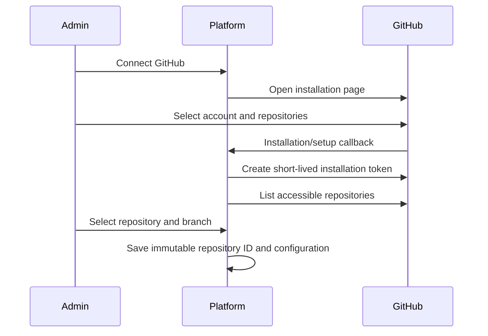

# Phase 2 — GitHub App และ Repository Picker

## เป้าหมาย

ให้ Admin เชื่อม GitHub App เลือก personal/organization installation, repository และ branch ได้ โดยรองรับ private repositories และไม่เก็บ Personal Access Token ระยะยาว

## GitHub App Configuration

### Repository permissions ขั้นต่ำ

- Metadata: Read (GitHub ให้โดยปริยาย)
- Contents: Read

### Webhook subscriptions

- `push`
- `installation`
- `installation_repositories`

### Secrets/configuration

- App ID
- Client ID/Client Secret เฉพาะกรณีใช้ user authorization
- Private key (PEM)
- Webhook secret
- Callback URL และ Setup URL

สำหรับ single-admin สามารถเริ่มด้วย installation flow โดยไม่ขอ user-to-server authorization หากระบบระบุ installation จาก callback/setup และตรวจความเป็นเจ้าของได้เพียงพอ

## User Flow



## API Surface

```text
GET    /api/v1/github/status
GET    /api/v1/github/install-url
GET    /api/v1/github/callback
GET    /api/v1/github/installations
GET    /api/v1/github/installations/:id/repositories
GET    /api/v1/github/branches
POST   /api/v1/github/webhooks
POST   /api/v1/projects/:id/source
DELETE /api/v1/projects/:id/source
```

## Token Strategy

- สร้าง GitHub App JWT (RS256) อายุสั้น (9 นาที) เมื่อต้องเรียก installation API
- สร้าง installation token เฉพาะเมื่อ list/validate repo/branch
- cache token ใน memory ได้ไม่เกินอายุ token ลบด้วย 5 นาที safety margin
- **ไม่เก็บ** installation token ลง DB
- ไม่เขียน token ลง clone URL, process output หรือ deployment log
- Private key อยู่ใน filesystem เท่านั้น ไม่ส่งออก response ใดๆ

## Repository Picker Requirements

- แสดง account avatar/name และ account type
- Search และ pagination
- แสดง private/public และ default branch
- กรองเฉพาะ repository ที่ installation เข้าถึงได้
- Branch picker แบบค้นหาและแบ่งหน้า
- เก็บ repository numeric ID + full name เพื่อรับมือ rename
- Refresh เมื่อได้รับ `installation_repositories`
- ปิด Auto Deploy หาก installation ถูก suspended/deleted หรือ repository ถูกถอนสิทธิ์

## Webhook Handling

- อ่าน raw request body ก่อน parse
- ตรวจ HMAC-SHA256 signature แบบ constant-time (WebCrypto)
- เก็บ `X-GitHub-Delivery` พร้อม unique constraint (idempotency)
- ตอบเร็วหลัง persist event แล้วให้ worker ประมวลผลต่อ
- ตรวจ installation ID, repository ID และ target branch
- `push` ที่ไม่ตรง branch ต้องไม่สร้าง deploy intent
- รองรับ deleted branch และ force push อย่างชัดเจน

## งานดำเนินการ

- [x] Migration 0003: `github_installations`, `webhook_deliveries`, `deploy_intents`
- [x] GitHub App config loader (env vars, lazy validation, null if unconfigured)
- [x] JWT signer (RS256, PKCS#1→PKCS#8 via manual ASN.1, WebCrypto)
- [x] Installation token cache (in-memory Map, 5-min safety margin)
- [x] GitHub HTTP client (typed, 15-sec timeout, error mapping)
- [x] GitHubService interface + RealGitHubService factory
- [x] Control API routes: 6 GitHub routes + POST/DELETE project source
- [x] Webhook route (raw body, HMAC-SHA256, idempotency, push/installation/repos events)
- [x] Dashboard: GitHubConnect.vue (configured/no-install/has-install states)
- [x] Dashboard: RepositoryPicker.vue (search, pagination, branch selection)
- [x] Dashboard: [id].vue Source tab (connected/revoked/picker states)
- [x] Log redaction for webhook_secret, pem, clone_url, access_token, JWT, GitHub tokens
- [x] Tests: JWT signing (10), token cache (10), webhook verification (unit + endpoint), GitHub routes
- [x] .env.example with GitHub App setup guide

## การทดสอบ

- [x] JWT: 3-part structure, RS256 header/payload claims, signature verify, tamper detection, PKCS#8 import
- [x] Token cache: empty state, valid get, expiry, safety margin, invalidate, multi-installation
- [x] Webhook signature: correct/wrong/null/no-prefix/body-tampered/wrong-secret
- [x] Webhook endpoint: valid/invalid signature → 200/401, duplicate delivery idempotent
- [x] Push events: correct branch creates intent, wrong branch/auto_deploy=0/deleted/tag → no intent
- [x] Single push creates exactly 1 intent even sent twice
- [x] Installation lifecycle: deleted/suspended/unsuspended → DB state + auto_deploy off
- [x] Repository removed → auto_deploy disabled for affected repos only
- [x] GitHub routes: all 8 endpoints, auth enforcement, CSRF, GITHUB_UNAVAILABLE when unconfigured

## Validation Results (Phase 2 completion)

```
bun install --frozen-lockfile   ✅
bun run lint                    ✅  0 errors, 7 warnings (pre-existing)
bun run typecheck               ✅  0 errors across 5 workspaces
bun test                        ✅  182 tests pass, 0 fail
bun run migrate:check           ✅  3/3 up, 3/3 down
bun run --filter @zixploy/dashboard build  ✅  build complete
```

## Exit Criteria

- [x] เชื่อม GitHub App และเลือก private repository/branch ผ่าน UI ได้
- [x] Webhook ที่ผ่านการตรวจสอบสร้าง deploy intent อย่าง idempotent
- [x] ไม่มี installation token ระยะยาวใน DB
- [x] Installation lifecycle สะท้อนใน Dashboard ถูกต้อง (revoked warning)
- [x] All GitHub routes validated; no tokens in browser responses
- [ ] Manual end-to-end test with real GitHub App (requires real App registration — Phase 2 implementation is mock-validated; real-app test deferred to staging)

## Mock-Only Items (Phase 2)

รายการต่อไปนี้ผ่าน tests โดย mock GitHub API — ยังไม่ได้ทดสอบกับ GitHub จริง:

- Real RS256 JWT accepted by GitHub API
- Installation token exchange over live HTTPS
- Real webhook delivery from GitHub servers

Phase 3 staging environment จะทดสอบ end-to-end flow เหล่านี้

## ไม่เริ่มในเฟสนี้ (Phase 3–8)

- Deploy Engine (Docker build/run)
- Environment variables management
- Domain routing
- Log streaming
- Volume management
