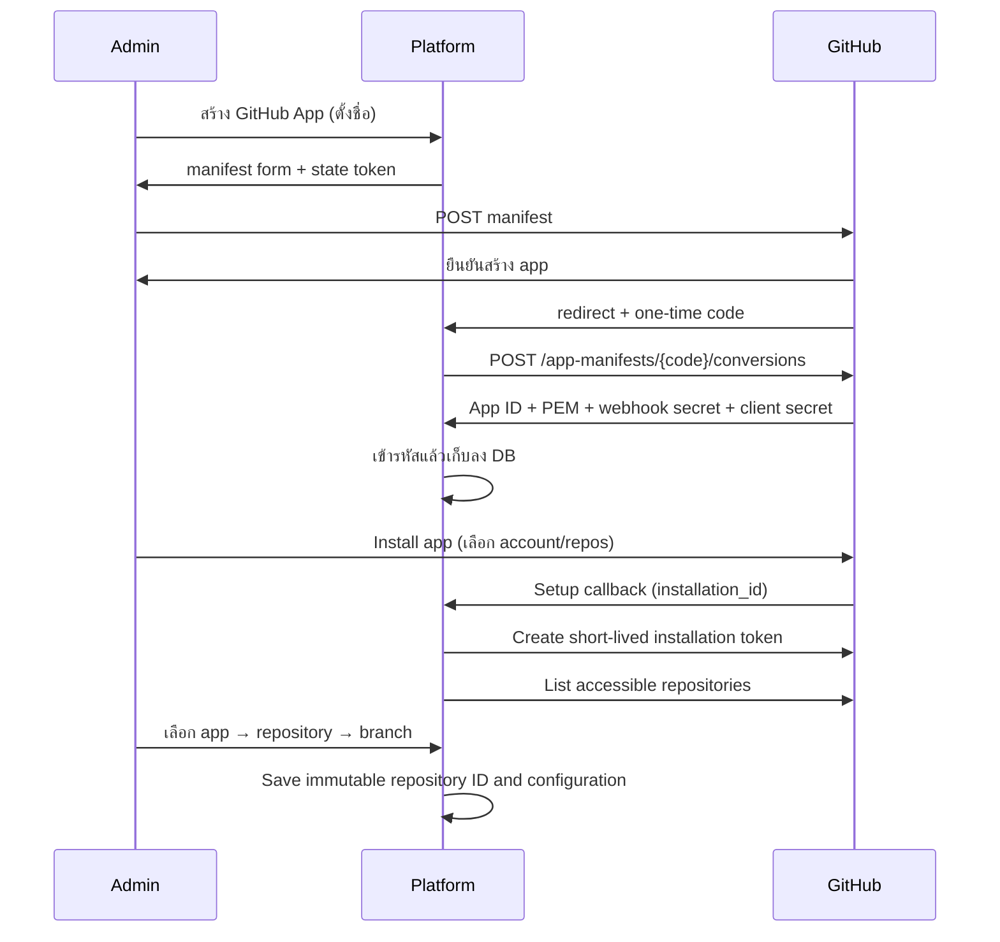

# Phase 2 — GitHub App และ Repository Picker

## เป้าหมาย

ให้ Admin **สร้าง GitHub App จากระบบเราเอง** (manifest flow แบบ Dokploy) เลือก personal/organization installation, repository และ branch ได้ โดยรองรับ private repositories และไม่เก็บ Personal Access Token ระยะยาว

## GitHub App Manifest Flow

GitHub Apps สร้างผ่าน UI ของระบบ ไม่ต้อง config env vars หรือคัดลอก key เอง:

1. Admin กรอกชื่อ app (+ organization ถ้าต้องการ) ที่หน้า `/settings/github`
2. ระบบ generate manifest JSON (webhook URL, permissions, events) → browser POST form ไป GitHub
3. Admin ยืนยันบน GitHub → GitHub สร้าง app → redirect กลับพร้อม one-time `code`
4. ระบบ exchange code ผ่าน `POST /app-manifests/{code}/conversions` → ได้ App ID, private key (PEM), webhook secret, client ID/secret ครบในครั้งเดียว
5. Credentials เข้ารหัส AES-256-GCM (envelope — docs/encryption.md) แล้วเก็บลง `github_apps`
6. Admin กด Install → เลือก account/repos บน GitHub → setup callback ผูก installation กับ app

รองรับหลาย GitHub App พร้อมกัน — แต่ละ app มี webhook endpoint + secret ของตัวเอง

### Permissions ที่ manifest ขอ (ขั้นต่ำ)

- Metadata: Read (GitHub ให้โดยปริยาย)
- Contents: Read
- Events: `push` (installation/installation_repositories ส่งให้ app อัตโนมัติ)
- `public: false` — app เป็น private

### Requirements

- `ZIXPLOY_MASTER_KEY_FILE` — master key 32-byte สำหรับเข้ารหัส credentials (fail closed ถ้าไฟล์ผิด)
- `ZIXPLOY_BASE_URL` — public URL ที่ GitHub เข้าถึงได้ (webhook + setup URL ฝังใน manifest)

## User Flow



## API Surface

```text
GET    /api/v1/github/status
GET    /api/v1/github/apps
POST   /api/v1/github/apps/manifest
GET    /api/v1/github/apps/callback
GET    /api/v1/github/apps/:id/install-url
GET    /api/v1/github/apps/:id/setup
DELETE /api/v1/github/apps/:id
GET    /api/v1/github/installations
GET    /api/v1/github/installations/:id/repositories
GET    /api/v1/github/branches
POST   /api/v1/github/webhooks/:appId
POST   /api/v1/projects/:id/source
DELETE /api/v1/projects/:id/source
```

## Token & Secret Strategy

- สร้าง GitHub App JWT (RS256) อายุสั้น (9 นาที) เมื่อต้องเรียก installation API
- สร้าง installation token เฉพาะเมื่อ list/validate repo/branch
- cache token ใน memory ได้ไม่เกินอายุ token ลบด้วย 5 นาที safety margin
- **ไม่เก็บ** installation token หรือ App JWT ลง DB — cache ใน memory เท่านั้น
- ไม่เขียน token ลง clone URL, process output หรือ deployment log
- Private key/webhook secret/client secret เก็บใน DB **แบบเข้ารหัส** (AES-256-GCM envelope,
  AAD ผูกกับ app row + field) — master key อยู่ filesystem เท่านั้น ไม่ส่งออก response ใดๆ
- CryptoKey cache ใน factory closure — import PEM ครั้งเดียว ไม่ re-parse ทุก JWT call
- Manifest state token: one-time use, TTL 15 นาที — กัน CSRF ใน manifest redirect

## Repository Picker Requirements

- แสดง account avatar/name และ account type
- Search และ pagination
- แสดง private/public และ default branch
- กรองเฉพาะ repository ที่ installation เข้าถึงได้
- Branch picker แบบค้นหาและแบ่งหน้า
- เก็บ repository numeric ID + full name เพื่อรับมือ rename
- Refresh เมื่อได้รับ `installation_repositories`
- ปิด Auto Deploy หาก installation ถูก suspended/deleted หรือ repository ถูกถอนสิทธิ์

## Webhook Handling

- อ่าน raw request body ก่อน parse
- ตรวจ HMAC-SHA256 signature แบบ constant-time (WebCrypto)
- Atomic `INSERT OR IGNORE` บน `delivery_id` (PRIMARY KEY) — ป้องกัน race condition
- Compare-and-set UPDATE เพื่อ claim processing lease (30 วินาที)
- Webhook processing state machine: `received → processing → processed | failed`
- Failed delivery retry: attempt_count < MAX_WEBHOOK_ATTEMPTS (3) → eligible for retry
- Stale lease recovery: processing นานกว่า 30s → reclaimable
- Permanent failure: invalid JSON → attempt_count exhausted → ไม่ retry
- Deploy intent สร้างด้วย `INSERT OR IGNORE` ป้องกัน intent ซ้ำ (UNIQUE INDEX บน `project_id + delivery_id`)

## Webhook Branch Validation

- `validateBranch` ใช้ `GET /repos/{owner}/{repo}/branches/{branch}` โดยตรง
- รองรับ repository ที่มี >100 branches (ไม่ต้อง paginate)
- GitHub ตอบ 404 ถ้า branch ไม่มีอยู่ → AppError("INSTALLATION_NOT_FOUND")

## GitHub Client Security

- Path segments encode ด้วย `encodeURIComponent` (owner, repo, branch name)
- Response size ตรวจเป็น byte (`Buffer.byteLength`) ไม่ใช่ JS char count
- JSON.parse ครอบด้วย try-catch → AppError (ไม่ให้ SyntaxError leak)
- Response shape validation: ตรวจ required fields ก่อน cast
- ไม่ log Authorization header, JWT, หรือ access token ใน error message

## งานดำเนินการ

- [x] Migration 0003: `github_installations`, `webhook_deliveries`, `deploy_intents`
- [x] Migration 0004: webhook processing state machine + deploy_intent UNIQUE INDEX
- [x] Migration 0005: `github_apps` (encrypted credentials) + `github_installations.github_app_id`
- [x] Encryption envelope (AES-256-GCM, AAD binding, key rotation) + master key loader
- [x] GitHub App manifest builder + code exchange (`POST /app-manifests/{code}/conversions`)
- [x] GitHubAppRegistry: app CRUD, per-app service cache, per-app webhook secret, state token
- [x] JWT signer (RS256, PKCS#1→PKCS#8 via manual ASN.1, WebCrypto)
- [x] Installation token cache (in-memory Map, 5-min safety margin)
- [x] GitHub HTTP client (typed, 15-sec timeout, path encoding, byte-accurate size, shape validation, error mapping)
- [x] GitHubService interface + RealGitHubService factory (CryptoKey cache, direct branch lookup)
- [x] Control API routes: app management (7) + installations/repos/branches + POST/DELETE project source
- [x] Webhook route per app (`/webhooks/:appId`, per-app secret, raw body, HMAC-SHA256, atomic idempotency, processing lease, state machine)
- [x] Dashboard: /settings/github (สร้าง app ผ่าน manifest, install, ลบ)
- [x] Dashboard: GitHubConnect.vue (no-master-key/no-app/no-install/has-install states)
- [x] Dashboard: RepositoryPicker.vue (app → repo → branch, search, pagination)
- [x] Dashboard: [id].vue Source tab (connected/revoked/picker states)
- [x] Log redaction for webhook_secret, pem, clone_url, access_token, JWT, GitHub tokens
- [x] Tests: JWT signing, token cache, webhook verification, GitHub routes, GitHub client, webhook state machine, encryption envelope, manifest flow, registry lifecycle

## การทดสอบ

- [x] JWT: 3-part structure, RS256 header/payload claims, signature verify, tamper detection, PKCS#8 import
- [x] Token cache: empty state, valid get, expiry, safety margin, invalidate, multi-installation
- [x] Webhook signature: correct/wrong/null/no-prefix/body-tampered/wrong-secret
- [x] Webhook endpoint: valid/invalid signature → 200/401, duplicate delivery idempotent
- [x] Push events: correct branch creates intent, wrong branch/auto_deploy=0/deleted/tag → no intent
- [x] Single push creates exactly 1 intent even sent twice
- [x] Installation lifecycle: deleted/suspended/unsuspended → DB state + auto_deploy off
- [x] Repository removed → auto_deploy disabled for affected repos only
- [x] GitHub routes: auth enforcement, CSRF, 502 เมื่อ master key/app ไม่พร้อม
- [x] Manifest flow: form URLs (personal/org), permissions ขั้นต่ำ, code exchange (success/expired/malformed/timeout)
- [x] Registry: encrypt ลง DB (ตรวจ ciphertext ≠ plaintext), state one-time use, deleteApp cascade
- [x] Envelope: round-trip, AAD binding, tampering detection, key rotation, format validation
- [x] Webhook state machine: atomic claim (only 1 of 2 concurrent claims succeeds), processed duplicate returns duplicate:true
- [x] Invalid JSON → 400, delivery marked failed (INVALID_PAYLOAD), attempt_count exhausted → no retry
- [x] Failed delivery (attempt < max) → retry via redeliver → processed
- [x] Stale processing lease (>30s) → recovery claim succeeds → processed
- [x] Exhausted delivery (attempt = max) → redeliver returns duplicate:true, status unchanged
- [x] deploy_intent UNIQUE INDEX: INSERT OR IGNORE on same (project_id, delivery_id) → 0 changes
- [x] GitHub client: path encoding, 4xx/5xx error mapping, malformed JSON, oversized response, missing fields, network error, timeout

## Validation Results (Phase 2 — manifest flow)

```
bun install --frozen-lockfile                    ✅  no changes
bun run lint                                     ✅  0 errors, 4 warnings (pre-existing Nuxt)
bun run typecheck                                ✅  0 errors across 5 workspaces
bun test                                         ✅  281 tests pass, 0 fail
bun run migrate:check                            ✅  5/5 up, 5/5 down
bun run --filter @zixploy/dashboard build        ✅  build complete
```

## Exit Criteria

- [x] สร้าง GitHub App จากระบบเองผ่าน manifest flow ได้ (mock-validated)
- [x] เชื่อม GitHub App และเลือก private repository/branch ผ่าน UI ได้ (mock-validated)
- [x] Webhook ที่ผ่านการตรวจสอบสร้าง deploy intent อย่าง idempotent (atomic INSERT OR IGNORE + DB UNIQUE INDEX)
- [x] ไม่มี installation token หรือ App JWT ใน DB — credentials เก็บแบบ encrypted เท่านั้น
- [x] Installation lifecycle สะท้อนใน Dashboard ถูกต้อง (revoked warning)
- [x] All GitHub routes validated; no tokens/PEM/secrets in browser responses
- [x] Webhook processing state machine: recovery, retry, exhausted — tested at DB level
- [ ] Manual end-to-end test with real GitHub App (requires public URL — mock-validated; real-app test deferred to staging)

## Mock-Only Items (Phase 2)

รายการต่อไปนี้ผ่าน tests โดย mock GitHub API — **ยังไม่ได้ทดสอบกับ GitHub จริง**:

- Manifest form POST + conversion exchange กับ GitHub จริง
- Real RS256 JWT accepted by GitHub API
- Installation token exchange over live HTTPS
- Real webhook delivery from GitHub servers (per-app endpoint)
- Branch validation via live `GET /repos/{owner}/{repo}/branches/{branch}`
- Path encoding behavior with real GitHub owner/repo names containing special chars

Phase 3 staging environment จะทดสอบ end-to-end flow เหล่านี้

## ไม่เริ่มในเฟสนี้ (Phase 3–8)

- Deploy Engine (Docker build/run)
- Environment variables management
- Domain routing
- Log streaming
- Volume management
