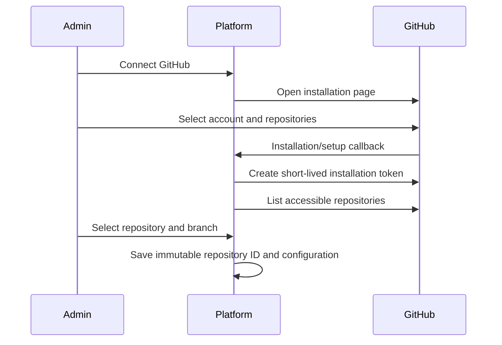

# Phase 2 — GitHub App และ Repository Picker

## เป้าหมาย

ให้ Admin เชื่อม GitHub App เลือก personal/organization installation, repository และ branch ได้ โดยรองรับ private repositories และไม่เก็บ Personal Access Token ระยะยาว

## GitHub App Configuration

### Repository permissions ขั้นต่ำ

- Metadata: Read (GitHub ให้โดยปริยาย)
- Contents: Read

### Webhook subscriptions

- `push`
- `installation`
- `installation_repositories`

### Secrets/configuration

- App ID
- Client ID/Client Secret เฉพาะกรณีใช้ user authorization
- Private key (PEM)
- Webhook secret
- Callback URL และ Setup URL

สำหรับ single-admin สามารถเริ่มด้วย installation flow โดยไม่ขอ user-to-server authorization หากระบบระบุ installation จาก callback/setup และตรวจความเป็นเจ้าของได้เพียงพอ

## User Flow



## API Surface

```text
GET    /api/v1/github/install-url
GET    /api/v1/github/callback
GET    /api/v1/github/installations
GET    /api/v1/github/installations/:id/repositories
GET    /api/v1/github/repositories/:id/branches
POST   /api/v1/github/webhooks
POST   /api/v1/projects/:id/source
DELETE /api/v1/github/installations/:id
```

## Token Strategy

- สร้าง GitHub App JWT อายุสั้นเมื่อต้องเรียก installation API
- สร้าง installation token เฉพาะเมื่อ list/clone/fetch
- cache token ใน memory ได้ไม่เกินอายุ token ลบด้วย safety margin
- ไม่เก็บ installation token ลง DB
- ไม่เขียน token ลง clone URL, process output หรือ deployment log
- ใช้ credential helper/askpass หรือ in-memory HTTP header สำหรับ Git operation

## Repository Picker Requirements

- แสดง account avatar/name และ account type
- Search และ pagination
- แสดง private/public และ default branch
- กรองเฉพาะ repository ที่ installation เข้าถึงได้
- Branch picker แบบค้นหาและแบ่งหน้า
- เก็บ repository numeric ID + full name เพื่อรับมือ rename
- Refresh เมื่อได้รับ `installation_repositories`
- ปิด Auto Deploy หาก installation ถูก suspended/deleted หรือ repository ถูกถอนสิทธิ์

## Webhook Handling

- อ่าน raw request body ก่อน parse
- ตรวจ HMAC signature แบบ constant-time
- เก็บ `X-GitHub-Delivery` พร้อม unique constraint
- ตอบเร็วหลัง persist event แล้วให้ worker ประมวลผลต่อ
- ตรวจ installation ID, repository ID และ target branch
- `push` ที่ไม่ตรง branch ต้องไม่สร้าง deploy job
- รองรับ deleted branch และ force push อย่างชัดเจน

## งานดำเนินการ

- [ ] Register GitHub App สำหรับ development
- [ ] สร้าง signer สำหรับ App JWT
- [ ] สร้าง installation token service พร้อม cache
- [ ] สร้าง installation/repository/branch APIs
- [ ] สร้าง Connect GitHub และ repository picker UI
- [ ] สร้าง webhook signature verification และ idempotency
- [ ] จัดการ installation lifecycle events
- [ ] เพิ่ม manual refresh และ reconnect flow
- [ ] ทำ redaction สำหรับ token และ authenticated Git URLs

## การทดสอบ

- Public และ private repository ปรากฏตามสิทธิ์ที่เลือก
- Repository ที่ไม่ได้อนุญาตไม่ปรากฏและ clone ไม่ได้
- Signature ผิด, payload ใหญ่เกิน และ delivery ซ้ำถูกปฏิเสธ
- Push ผิด branch ไม่ deploy; push ถูก branchสร้างงานเดียว
- ถอน repository หรือ uninstall App แล้ว project แสดงสถานะแก้ไขได้
- Organization installation pending approval แสดงคำอธิบายที่เข้าใจได้

## Exit Criteria

- เชื่อม GitHub App และเลือก private repository/branch ผ่าน UI ได้
- Webhook ที่ผ่านการตรวจสอบสร้าง deploy trigger ได้อย่าง idempotent
- ไม่มี token ระยะยาวหรือ token leakage
- Installation lifecycle สะท้อนใน Dashboard ถูกต้อง

